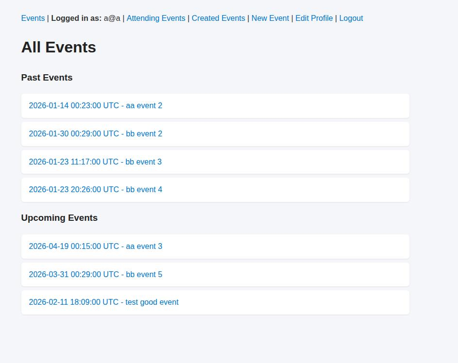
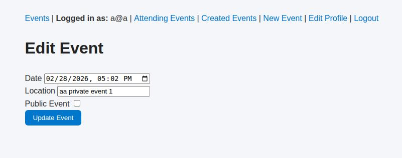
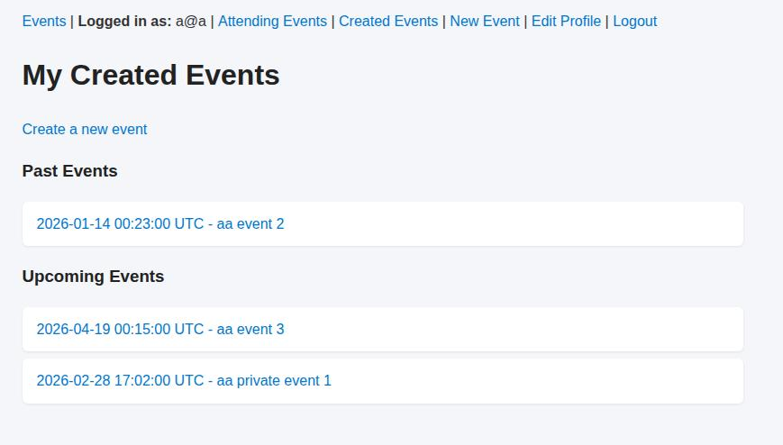
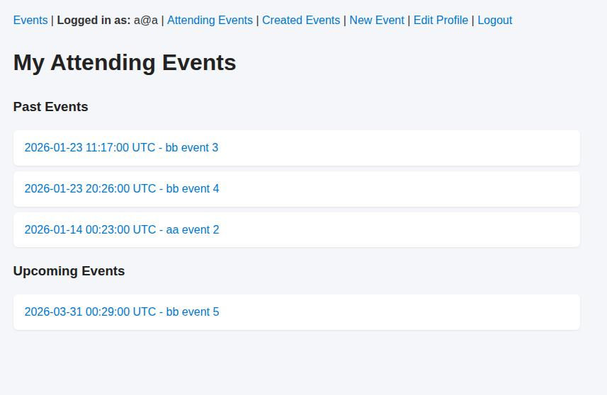

# Private Events

A simple Ruby on Rails app where users can create events, attend events, and control whether events are public or private.

## Features

* Authentication with Devise
* Create and manage events
* Attend / cancel attendance
* Public and private event visibility
* Past and upcoming event separation
* Creator-only editing

---

## Screenshots

### Public Events Index

Shows all publicly visible events.

---

### Edit Event

Creators can set the date, location, and toggle event visibility.

---

### Created Events

Displays events created by the user, including private ones visible only to the creator.

---

### Attending Events

Shows the events a user is attending.

